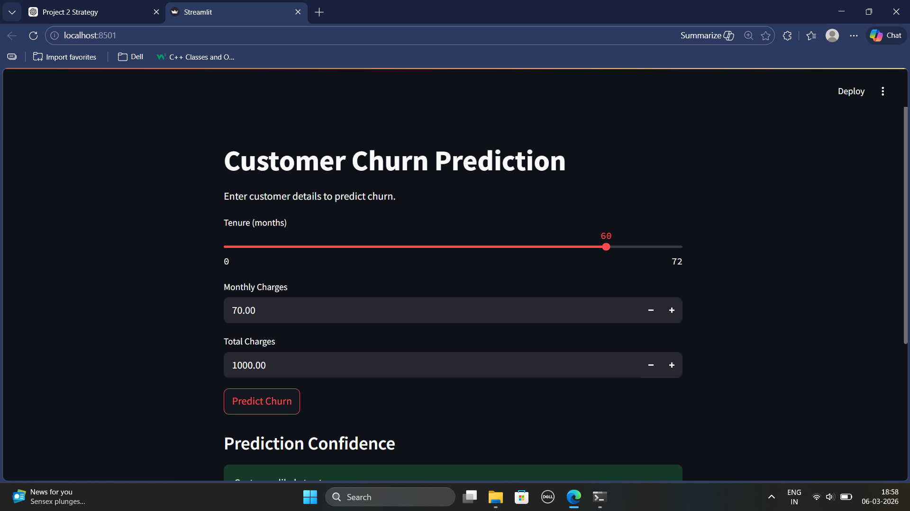
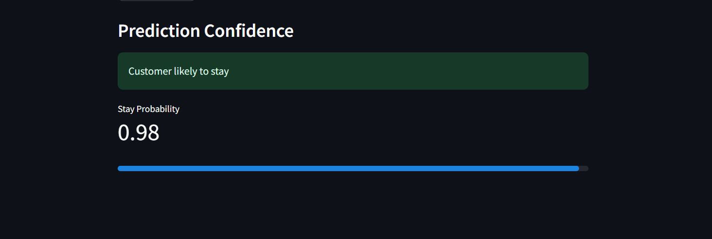

# 📊 Customer Churn Prediction


A Machine Learning project that predicts whether a telecom customer is likely to **churn (leave the service)** based on their usage and billing information.

This project demonstrates a **complete ML pipeline** including:

- Data preprocessing
- Feature engineering
- Model training
- Model evaluation
- Feature importance analysis
- Deployment using **Streamlit**

---

# 🚀 Project Overview

Customer churn prediction is a key problem in the telecom industry.  
Retaining existing customers is **significantly cheaper than acquiring new ones**.

Using the **Telco Customer Churn Dataset**, this project builds a classification model to predict whether a customer will **churn or stay**.

---

# 📂 Dataset

Dataset used: **Telco Customer Churn Dataset**

It contains **7043 customer records** with features such as:

- Tenure
- Monthly Charges
- Total Charges
- Contract Type
- Internet Service
- Payment Method
- Streaming Services
- Technical Support
- Demographic Information

### Target Variable

```
Churn
0 → Customer stays
1 → Customer leaves
```

---

# ⚙️ Machine Learning Pipeline

## 1️⃣ Data Cleaning

- Converted `TotalCharges` to numeric
- Handled missing values
- Removed unnecessary columns (`customerID`)

---

## 2️⃣ Feature Engineering

- One-hot encoding for categorical variables

---

## 3️⃣ Train-Test Split

```
80% Training
20% Testing
```

---

## 4️⃣ Feature Scaling

Used **StandardScaler** for numerical features.

---

## 5️⃣ Models Trained

Two models were trained and compared:

- Logistic Regression
- Random Forest Classifier

---

## 6️⃣ Model Evaluation

Metrics used:

- Accuracy
- Confusion Matrix
- Classification Report
- ROC-AUC Score

### Final ROC-AUC Score

```
0.86
```

---

# 📈 Feature Importance

Using logistic regression coefficients, the most influential features include:

- `InternetService_Fiber optic`
- `TotalCharges`
- `StreamingMovies`
- `PaperlessBilling`
- `PaymentMethod_Electronic check`

---

# 🖥️ Streamlit Application

A simple interactive **Streamlit web application** was built to test the trained model.

Users can input:

- Tenure
- Monthly Charges
- Total Charges

The app predicts whether the customer is likely to:

```
Stay
or
Churn
```

### Run the app

```bash
streamlit run app.py
```

---

# 📸 Application Preview

### User Interface



### Prediction Result



---

# 📁 Project Structure

```
customer-churn
│
├── assets
│   ├── app_ui.png
│   └── prediction_result.png
│
├── data
│   └── WA_Fn-UseC_-Telco-Customer-Churn.csv
│
├── models
│   ├── churn_model.pkl
│   └── scaler.pkl
│
├── notebooks
│   └── 01_data_understanding.ipynb
│
├── app.py
├── requirements.txt
├── README.md
└── .gitignore
```

---

# 🛠️ Installation

Clone the repository:

```bash
git clone https://github.com/subesh-cse/customer-churn-prediction.git
```

Move into the project directory:

```bash
cd customer-churn
```

Install dependencies:

```bash
pip install -r requirements.txt
```

Run the Streamlit application:

```bash
streamlit run app.py
```

---

# 🧰 Technologies Used

- Python
- Pandas
- NumPy
- Scikit-learn
- Matplotlib
- Streamlit
- Joblib

---

# ⚠️ Note

The model was trained using the full dataset containing **30+ features**.

For simplicity, the Streamlit interface currently uses only:

- `tenure`
- `MonthlyCharges`
- `TotalCharges`

Other features are set to default values, so predictions in the demo interface may not perfectly represent real-world scenarios.

---

# 🔮 Future Improvements

Possible enhancements for this project:

- Add full feature support in the Streamlit UI
- Hyperparameter tuning
- Cross-validation
- Model explainability using **SHAP**
- Deploy the application online

---

# 👨‍💻 Author

Machine Learning Project built as part of a learning journey in **applied ML and model deployment**.
